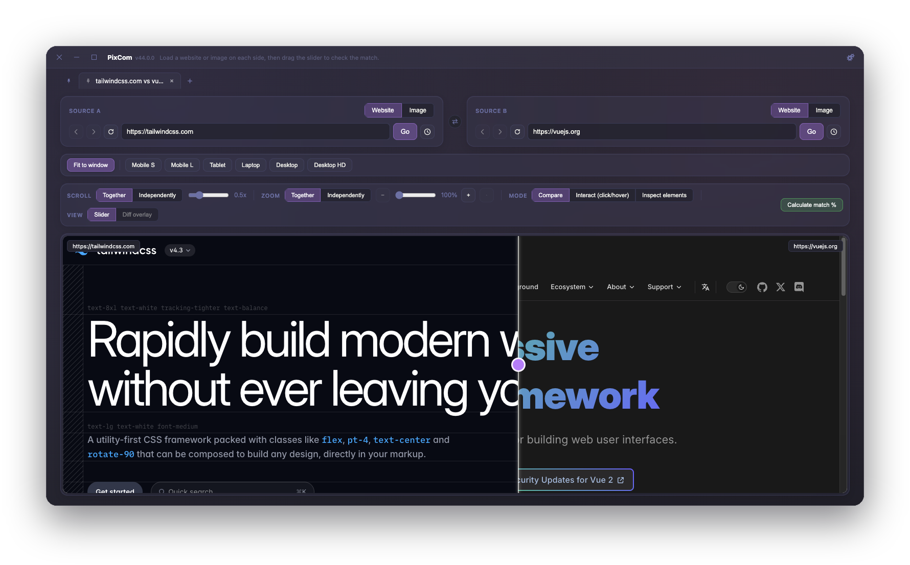

<div align="center">

# PixCom

**Compare two websites or images, pixel by pixel — live, not screenshot to screenshot.**

[](https://github.com/baris5d/PixCom/releases/latest)
[](https://github.com/baris5d/PixCom/releases/latest)
[](#)

<br/>



</div>

<br/>

Drag a slider over two live pages (or images) instead of eyeballing two static
screenshots. Built for checking a design against its implementation, staging against
production, or one browser against another — without leaving the desktop.

## Features

|  |  |
| --- | --- |
| 🔀 **Compare anything** | Website vs website, website vs image, or image vs image — both sides render live, so the slider clips the real page, not a screenshot. |
| 🗂️ **Multiple workspaces** | Open several comparisons as tabs, pin the ones you revisit often, switch instantly without losing scroll or navigation state. |
| 🕘 **History & session restore** | Every URL visited is one click away from the address bar; close the app and reopen it to find every tab exactly as you left it. |
| 🔍 **Canvas zoom & pan** | Ctrl/Cmd + scroll (or pinch) to zoom into either or both pages, then drag to pan — like zooming a page in a browser. |
| 📊 **Pixel-diff match %** | One click captures both sides and reports a match percentage, or crop it down to two hand-picked elements. |
| 🧬 **Live element inspector** | Click anything on either page for its DOM structure, matched CSS rules, and computed styles, side by side. |
| 🎨 **22 built-in themes** | Dracula, Nord, Solarized, Catppuccin, Tokyo Night, and more — or drop in your own as a JSON file. |
| ⬆️ **Self-updating** | Packaged builds check for new versions and install them in one click, with a changelog shown right after. |

## Usage

Type a URL (or pick an image) on each side and hit **Go** — the slider appears once
both sides are loaded.

- Drag the **slider** to reveal one side over the other; scroll to move both pages in
  lockstep or independently.
- Pick a **device size** to compare at an exact viewport, or leave it on "Fit to
  window".
- Switch to **Inspect elements** to click into either page's DOM and CSS.
- **Calculate match %** for an instant pixel-diff score.
- Open a **new tab** for a separate comparison, and **pin** the ones you want to keep
  around.

## Contributing

```bash
npm install
npm run dev      # starts the app with renderer hot reload
npm run typecheck
```

Main process and preload changes (`src/main/`, `src/preload/`) aren't hot-reloaded —
quit the app and run `npm run dev` again to pick those up. Run `npm run typecheck`
before opening a PR; there's no separate lint/test step yet.

Pull requests welcome — for anything larger than a small fix, open an issue first to
talk through the approach. Building an installer, cutting a release, or setting up
code signing? See [`docs/BUILDING.md`](docs/BUILDING.md).
